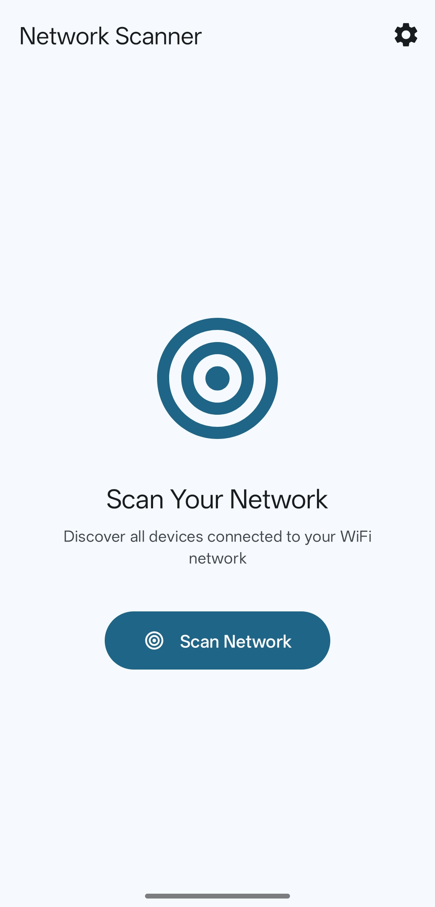
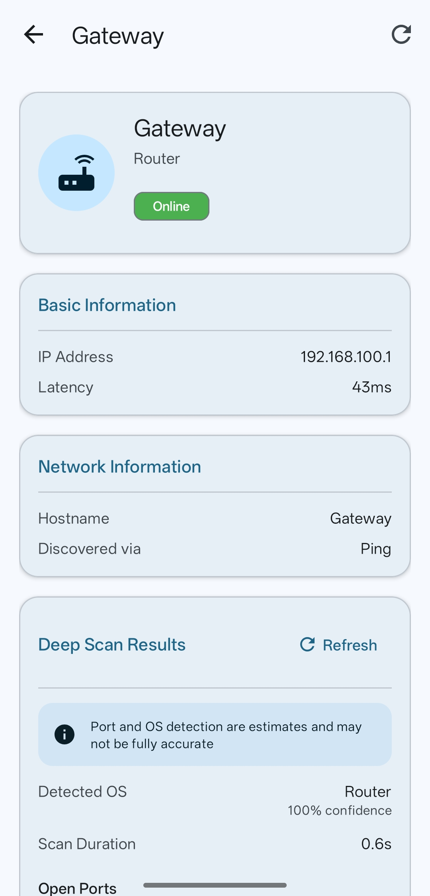
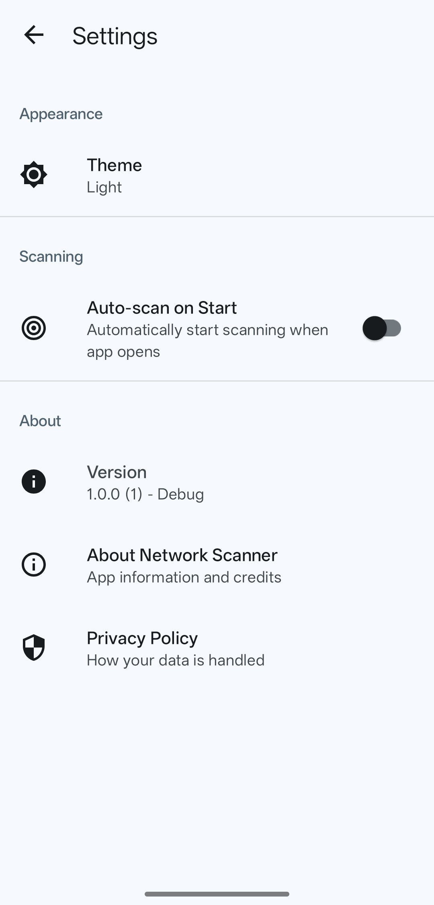
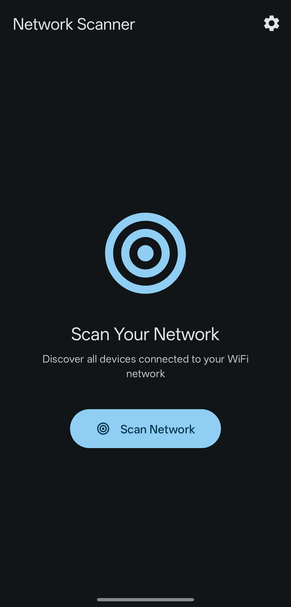

# Network Scanner

[](https://www.gnu.org/licenses/gpl-3.0)

A fast, privacy-focused network scanner for Android that helps you discover and analyze devices on your local network.

## Features

- 🔍 **Fast Network Scanning** - Quickly discover all devices on your network
- 📱 **Device Details** - View IP addresses, MAC addresses, hostnames, and more
- 🔓 **Port Scanning** - Identify open ports and running services
- 🎨 **Material Design 3** - Modern, beautiful interface following latest design guidelines
- 🔒 **Privacy First** - No ads, no tracking, no analytics
- 🚀 **Lightweight** - Minimal permissions, efficient battery usage
- 📡 **Offline** - Works completely offline, no internet required

## Screenshots

<p align="center">
  
  
  
  
  
</p>

## Download

### F-Droid
_Submission in progress_

### GitHub Releases
Download the latest APK from the [Releases](https://github.com/usamaiqb/network-scanner/releases) page.

## Requirements

- Android 8.0 (Oreo) or higher
- WiFi connection to scan local network

## Permissions

Network Scanner requests only essential permissions:

- **INTERNET** - For network communication
- **ACCESS_NETWORK_STATE** - To check network connectivity
- **ACCESS_WIFI_STATE** - To get WiFi information
- **CHANGE_WIFI_MULTICAST_STATE** - For network device discovery
- **NEARBY_WIFI_DEVICES** (Android 13+) - To discover nearby WiFi devices
- **ACCESS_FINE_LOCATION** / **ACCESS_COARSE_LOCATION** - Required by Android for WiFi scanning (not used for location tracking)

## Building from Source

### Prerequisites
- Android Studio Hedgehog (2023.1.1) or later
- JDK 17
- Android SDK with API level 34

### Build Steps

1. Clone the repository:
```bash
git clone https://github.com/usamaiqb/network-scanner.git
cd network-scanner
```

2. Open in Android Studio or build from command line:
```bash
./gradlew assembleRelease
```

3. The APK will be in `app/build/outputs/apk/release/`

## Usage

1. Open the app and grant necessary permissions
2. Tap the scan button to discover devices
3. Tap any device to view detailed information
4. Use the deep scan option for port scanning

## Contributing

Contributions are welcome! Please read [CONTRIBUTING.md](CONTRIBUTING.md) for guidelines.

## License

This project is licensed under the GNU General Public License v3.0 - see the [LICENSE](LICENSE) file for details.

## Privacy

Network Scanner:
- ✅ Does NOT collect any personal data
- ✅ Does NOT require internet connection
- ✅ Does NOT contain ads or tracking
- ✅ Does NOT share data with third parties
- ✅ All scanning happens locally on your device

## Support

- **Issues**: [GitHub Issues](https://github.com/usamaiqb/network-scanner/issues)
- **Discussions**: [GitHub Discussions](https://github.com/usamaiqb/network-scanner/discussions)

## Acknowledgments

Built with:
- [Kotlin](https://kotlinlang.org/) - Modern programming language for Android
- [AndroidX](https://developer.android.com/jetpack/androidx) - Android Jetpack libraries
- [Material Design 3](https://m3.material.io/) - Modern design system
- [Kotlin Coroutines](https://kotlinlang.org/docs/coroutines-overview.html) - Asynchronous programming

## Changelog

See [CHANGELOG.md](CHANGELOG.md) for version history and changes.

---

Made with ❤️ for the open source community
