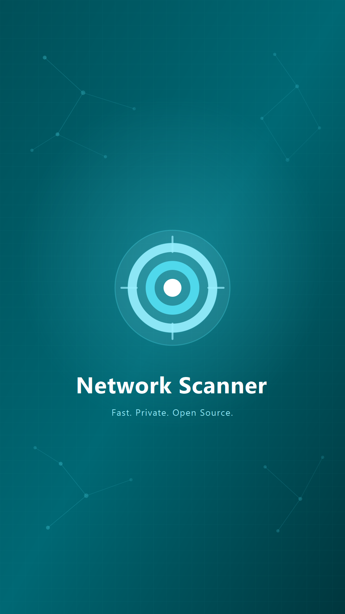
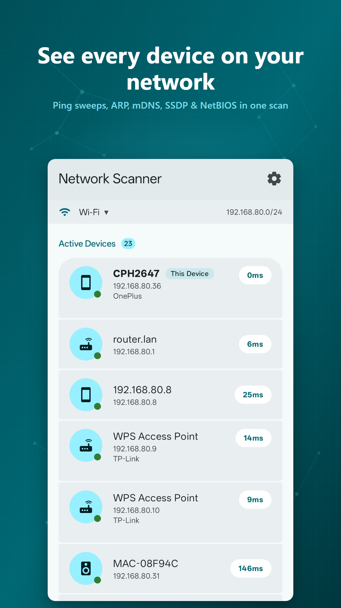
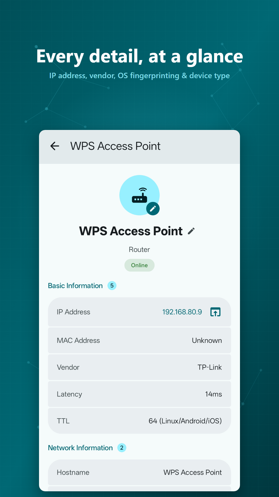
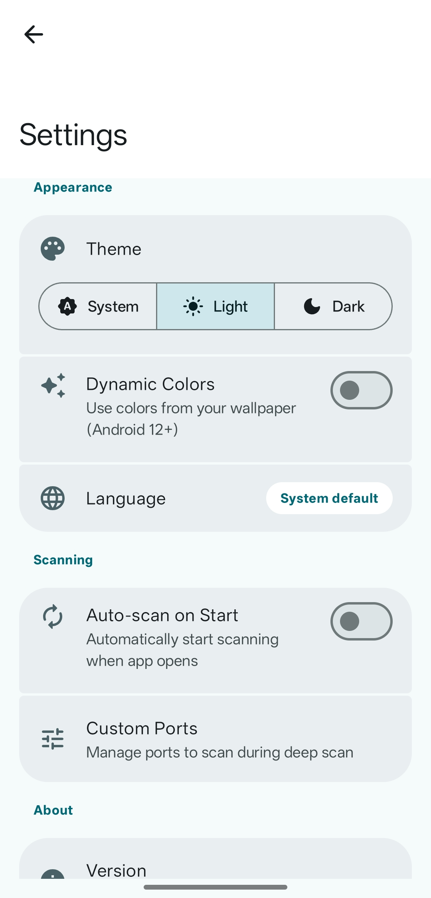
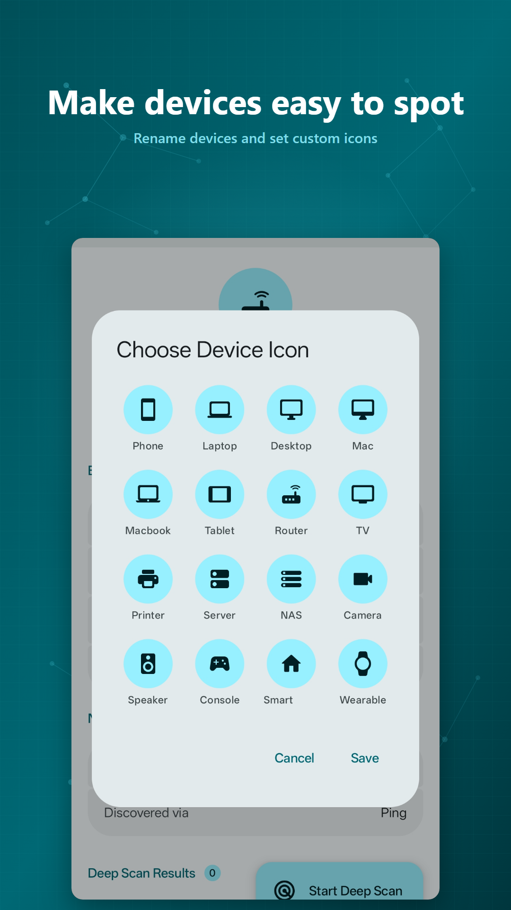

<div align="center">


# Network Scanner

### A fast, privacy-focused network scanner for Android

<p align="center">
  <a href="https://github.com/usamaiqb/network-scanner/actions/workflows/ci.yml"></a>
  <a href="https://github.com/usamaiqb/network-scanner/releases"></a>
  <a href="https://f-droid.org/packages/com.networkscanner.app/"></a>
  
  
  <a href="https://www.gnu.org/licenses/gpl-3.0"></a>
</p>

</div>

Discover and analyze devices on your local network with no ads, no tracking, and no internet required.

<p align="center">
  <a href="https://play.google.com/store/apps/details?id=com.networkscanner.app"></a>
  <a href="https://f-droid.org/packages/com.networkscanner.app/"></a>
</p>

Download the latest APK from the [Releases](https://github.com/usamaiqb/network-scanner/releases) page.

## Features

### Device Discovery
- 🔍 **Ping Sweep** - Parallel ICMP ping sweep with TCP fallback for devices that block ICMP (e.g. Windows with firewall)
- 📋 **ARP Cache** - Reads the ARP table to pick up devices without sending any traffic
- 📡 **mDNS / Bonjour** - Discovers services like AirPlay, Chromecast, printers, SSH, SMB, HomeKit, and more
- 📺 **SSDP / UPnP** - Finds UPnP devices and fetches their full description (friendly name, manufacturer, model number)
- 🪟 **NetBIOS** - Resolves hostnames and workgroups for Windows and Samba devices
- 🔌 **Port Heuristics** - Identifies Cast-enabled TVs and other devices via targeted port probes when other methods come up empty

### Device Information
- 🏷️ **MAC Address & Vendor** - Shows MAC address with OUI vendor lookup, including detection of randomized (private) MAC addresses¹
- 🖥️ **OS Fingerprinting** - Detects Windows, Linux, macOS, router firmware, and printer OS from open ports and banners
- 📱 **Device Type Icons** - Automatically identifies smartphones, laptops, desktops, TVs, routers, printers, NAS, and more
- 🔓 **Deep Port Scan** - Scans common ports, grabs service banners, and extracts software versions
- 🧩 **Full Port Scan** - Optional sweep of all 65,535 ports via a fast worker pool
- ⚙️ **Configurable Ports** - Customize which ports are probed during scans

### App
- 🏷️ **Custom Devices** - Rename devices and assign your own icons for easy identification
- 📶 **Interface Selection** - Choose which network interface to scan (Wi-Fi, Ethernet, VPN)
- 🌍 **Multilingual** - Available in multiple languages (see [Translations](#translations))
- 🎨 **Material Design 3** - Modern interface following latest design guidelines
- 🔒 **Privacy First** - No ads, no tracking, no analytics
- 🚀 **Lightweight** - Minimal permissions, efficient battery usage
- 📡 **Offline** - Works completely offline, no internet required

## Screenshots

<p align="center">
  
  
  
  
  
</p>

## Requirements

- Android 8.0 (Oreo) or higher
- WiFi connection to scan local network

<details>
<summary><h2>Permissions</h2></summary>

Network Scanner requests only essential permissions:

- **INTERNET** - For network communication
- **ACCESS_NETWORK_STATE** - To check network connectivity
- **ACCESS_WIFI_STATE** - To get WiFi information
- **CHANGE_WIFI_MULTICAST_STATE** - For network device discovery
- **NEARBY_WIFI_DEVICES** (Android 13+) - To discover nearby WiFi devices. On Android 16+ this permission also gates local network access (sockets to local addresses, mDNS, SSDP), so scanning cannot work without it
- **ACCESS_FINE_LOCATION** / **ACCESS_COARSE_LOCATION** - Optional. Used only to read WiFi network details such as the SSID, and never for location tracking; scanning works without it

</details>

<details>
<summary><h2>Building from Source</h2></summary>

### Prerequisites
- Android Studio Hedgehog (2023.1.1) or later
- JDK 17
- Android SDK with API level 36

### Build Steps

1. Clone the repository:
```bash
git clone https://github.com/usamaiqb/network-scanner.git
cd network-scanner
```

2. Open in Android Studio or build from command line:
```bash
./gradlew assembleRelease
```

3. The APK will be in `app/build/outputs/apk/release/`

</details>

## Usage

1. Open the app and grant necessary permissions
2. Tap the scan button to discover devices
3. Tap any device to view detailed information
4. Use the deep scan option for port scanning, or run a full port scan for all 65,535 ports
5. Rename devices or assign custom icons to keep track of your network

## Translations

<!-- translations:start -->
| Language | Progress |
| --- | --- |
| English | ████████████ 100% (source) |
| العربية | ████████████ 99% |
| Español | ████████████ 99% |
| Italiano | ████████████ 99% |
| Русский | ███████████░ 91% |
| Українська | ████████████ 99% |
| 中文 (中国) | ████████████ 100% |
<!-- translations:end -->


Contributions to translations are welcome!

<details>
<summary><h2>Known Limitations</h2></summary>

¹ **MAC addresses on Android 10+**: Since Android 10, apps can no longer read other devices' entries from the system's ARP table (SELinux restriction). This means MAC address and vendor lookup reliably works for your own device (and sometimes the router), but shows as "Unknown" for other devices on the network on Android 10 and above. This is an OS-level restriction that affects all network scanner apps, not a bug specific to this app, and can't be worked around without root access.

</details>

## Contributing

Contributions are welcome! Please read [CONTRIBUTING.md](CONTRIBUTING.md) for guidelines.

## License

This project is licensed under the GNU General Public License v3.0 - see the [LICENSE](LICENSE) file for details.

## Privacy

Network Scanner:
- ✅ Does NOT collect any personal data
- ✅ Does NOT require internet connection
- ✅ Does NOT contain ads or tracking
- ✅ Does NOT share data with third parties
- ✅ All scanning happens locally on your device

For full details, see the [Privacy Policy](PRIVACY_POLICY.md).

## Support

- **Issues**: [GitHub Issues](https://github.com/usamaiqb/network-scanner/issues)
- **Discussions**: [GitHub Discussions](https://github.com/usamaiqb/network-scanner/discussions)

<details>
<summary><h2>Acknowledgments</h2></summary>

Built with:
- [Kotlin](https://kotlinlang.org/) - Modern programming language for Android
- [AndroidX](https://developer.android.com/jetpack/androidx) - Android Jetpack libraries
- [Material Design 3](https://m3.material.io/) - Modern design system
- [Kotlin Coroutines](https://kotlinlang.org/docs/coroutines-overview.html) - Asynchronous programming

</details>

## Changelog

See [CHANGELOG.md](CHANGELOG.md) for version history and changes.

---

Made with ❤️ for the open source community
