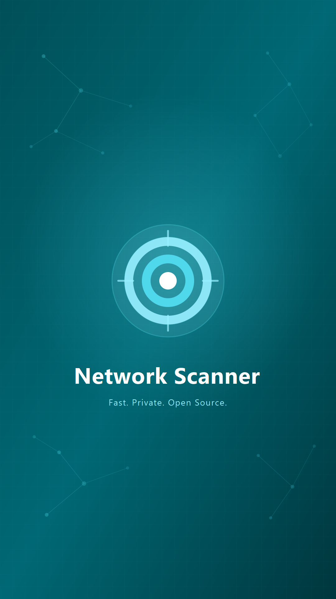
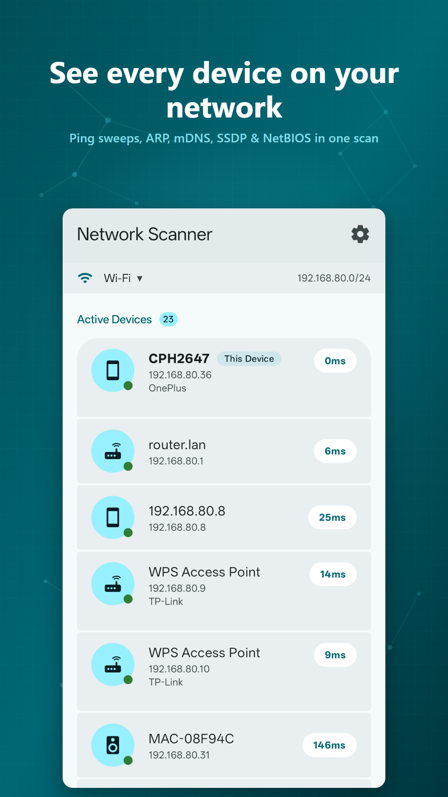
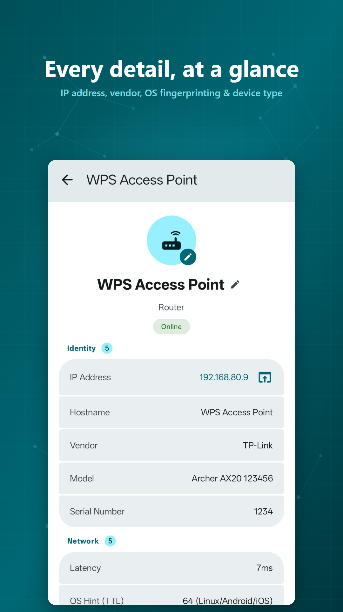
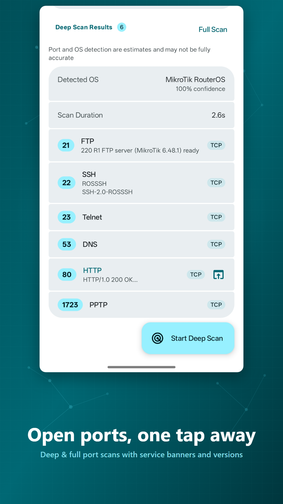
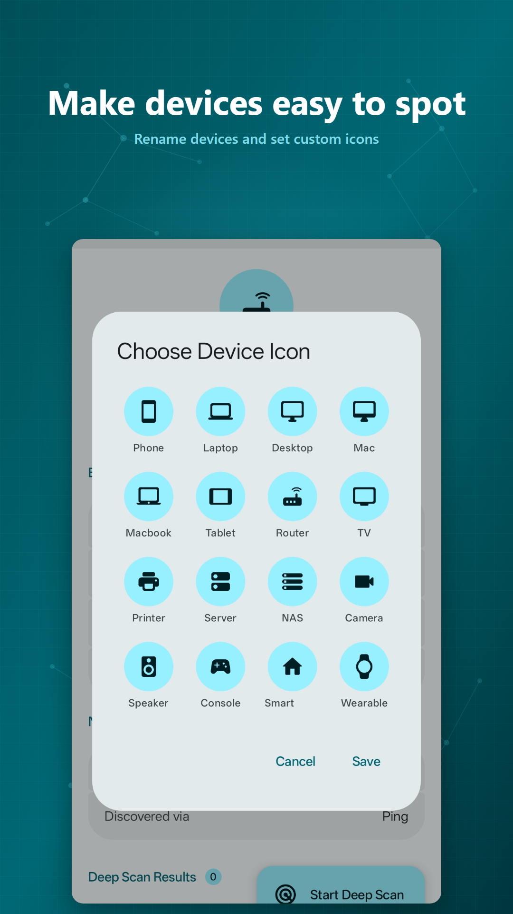
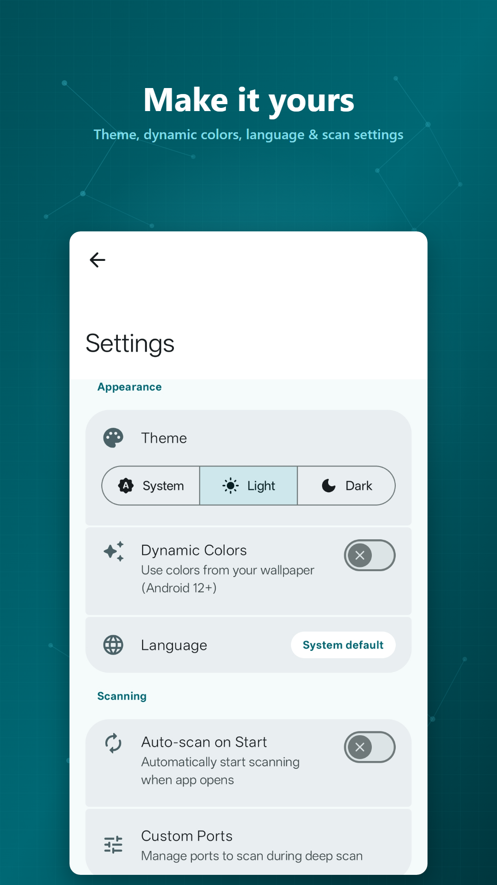

<div align="center">


# Network Scanner

A fast, privacy-focused network scanner for Android

<p align="center">
  <a href="https://github.com/usamaiqb/network-scanner/actions/workflows/ci.yml"></a>
  <a href="https://github.com/usamaiqb/network-scanner/releases"></a>
  <a href="https://f-droid.org/packages/com.networkscanner.app/"></a>
  <a href="https://www.gnu.org/licenses/gpl-3.0"></a>
</p>

</div>

Find every device on your local network, with its IP address, hostname, open ports, and device type. No ads, no tracking, no root required, and it works fully offline.

<p align="center">
  <a href="https://play.google.com/store/apps/details?id=com.networkscanner.app"></a>
  <a href="https://f-droid.org/packages/com.networkscanner.app/"></a>
</p>

Download the latest APK from the [Releases](https://github.com/usamaiqb/network-scanner/releases) page.

## Screenshots

<p align="center">
  
  
  
  
  
  
</p>

## Features

### Discovery

- **Ping sweep** - Parallel ICMP sweep with TCP fallback for devices that block ICMP
- **ARP cache** - Picks up devices without sending any traffic
- **mDNS / Bonjour** - Finds AirPlay, Chromecast, printers, SSH, SMB, HomeKit, and more
- **SSDP / UPnP** - Fetches friendly name, manufacturer, and model number
- **NetBIOS** - Resolves hostnames and workgroups for Windows and Samba devices
- **Port heuristics** - Identifies Cast-enabled TVs and similar devices when other methods come up empty

### Device details

- **MAC address & vendor** - OUI vendor lookup, with detection of randomized MAC addresses (see [Known limitations](#known-limitations))
- **OS fingerprinting** - Detects Windows, Linux, macOS, router firmware, and printer OS from open ports and banners
- **Device type icons** - Smartphones, laptops, TVs, routers, printers, NAS, and more
- **Port scanning** - Deep scan of common ports with banner grabbing and version detection, or a full sweep of all 65,535 ports
- **Copy & open** - Long press any detail to copy it, or tap an open web port to open it in your browser
- **Customization** - Rename devices, assign icons, choose the network interface (Wi-Fi, Ethernet, VPN), and configure probed ports

## Requirements

- Android 8.0 (Oreo) or higher
- A local network connection (Wi-Fi, Ethernet, or VPN)

## Verification

Builds from this repository, Google Play and F-Droid are all signed with the same key. Verify the signing certificate rather than the APK file hash — each store repackages the APK, so file hashes differ while the certificate stays the same.

- **Package:** `com.networkscanner.app`
- **Certificate SHA-256:** `CF:89:91:3C:18:DC:8E:F3:0C:88:F0:95:7C:C4:92:EA:EA:04:20:20:44:FD:D4:26:0D:9C:CB:CA:97:9E:0F:FA`

Check it with an on-device verifier app, or `apksigner verify --print-certs <apk>`, which prints the same value in lower case without colons.

<details>
<summary><h2>Permissions</h2></summary>

- **INTERNET** - Required by Android to open any network socket, including local-network scans; the app never contacts the internet
- **ACCESS_NETWORK_STATE** - To check network connectivity
- **ACCESS_WIFI_STATE** - To get Wi-Fi information
- **CHANGE_WIFI_MULTICAST_STATE** - For network device discovery
- **NEARBY_WIFI_DEVICES** (Android 13+) - To discover nearby Wi-Fi devices. On Android 16+ this permission also gates local network access (sockets to local addresses, mDNS, SSDP), so scanning cannot work without it
- **ACCESS_FINE_LOCATION** / **ACCESS_COARSE_LOCATION** - Optional. Used only to read Wi-Fi network details such as the SSID, and never for location tracking; scanning works without it

</details>

## Building

Requires JDK 17 and the Android SDK (API 36).

```bash
git clone https://github.com/usamaiqb/network-scanner.git
cd network-scanner
./gradlew assembleDebug
```

The APK is written to `app/build/outputs/apk/debug/`. See [CONTRIBUTING.md](CONTRIBUTING.md) for the full development setup.

## Translations

<!-- translations:start -->
| Language | Progress |
| --- | --- |
| English | ████████████ 100% (source) |
| العربية | ████████████ 99% |
| Español | ████████████ 99% |
| Italiano | ████████████ 99% |
| Русский | ███████████░ 91% |
| Українська | ████████████ 99% |
| 中文 (中国) | ████████████ 100% |
<!-- translations:end -->

To add or improve a translation, edit `app/src/main/res/values-<locale>/strings.xml` and open a pull request.

## Known limitations

Since Android 10, apps can't read other devices' entries from the system ARP table, so MAC address and vendor only appear for your own device and sometimes the router. This affects every network scanner app and can't be bypassed without root.

## Contributing

Contributions are welcome. Read [CONTRIBUTING.md](CONTRIBUTING.md) first, and use [Issues](https://github.com/usamaiqb/network-scanner/issues) or [Discussions](https://github.com/usamaiqb/network-scanner/discussions) for bugs and questions.

## License

[GNU General Public License v3.0](LICENSE). See the [Privacy Policy](PRIVACY_POLICY.md) for how the app handles data.
